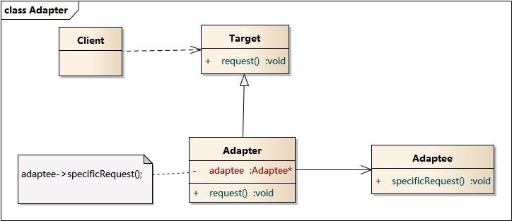
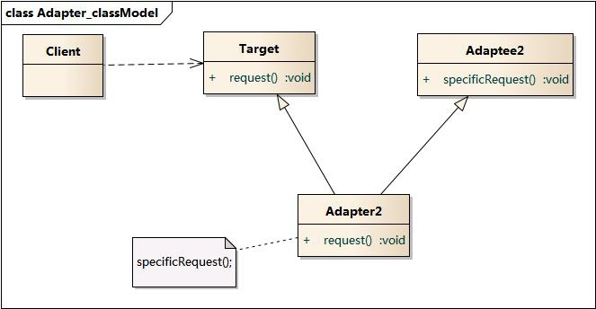

适配器模式（Adapter Pattern）是作为两个不兼容的接口之间的桥梁。这种类型的设计模式属于结构型模式，它结合了两个独立接口的功能。

这种模式涉及到一个单一的类，该类负责加入独立的或不兼容的接口功能。举个真实的例子，读卡器是作为内存卡和笔记本之间的适配器。您将内存卡插入读卡器，再将读卡器插入笔记本，这样就可以通过笔记本来读取内存卡。

我们通过下面的实例来演示适配器模式的使用。其中，音频播放器设备只能播放 mp3 文件，通过使用一个更高级的音频播放器来播放 vlc 和 mp4 文件。

## 实现

我们有一个`MediaPlayer`接口和一个实现了`MediaPlayer`接口的实体类`AudioPlayer`。默认情况下，`AudioPlayer`可以播放mp3格式的音频文件。

我们还有另一个接口` AdvancedMediaPlayer `和实现了` AdvancedMediaPlayer `接口的实体类。该类可以播放vlc和mp4格式的文件。

我们想要让` AudioPlayer `播放其他格式的音频文件。为了实现这个功能，我们需要创建一个实现了`MediaPlayer`接口的适配器类`MediaAdapter`，并使用` AdvancedMediaPlayer `对象来播放所需的格式。

`AudioPlayer`使用适配器类` MediaAdapter `传递所需的音频类型，不需要知道能播放所需格式音频的实际类。`AdapterPatternDemo` 类使用 `AudioPlayer` 类来播放各种格式。

:::tip
适配器模式包含如下角色：

- Target：目标抽象类
- Adapter：适配器类
- Adaptee：适配者类
- Client：客户类
:::

适配器模式有对象适配器和类适配器两种实现：

### 对象适配器

### 类适配器

## 优点

- 将目标类和适配者类解耦，通过引入一个适配器类来重用现有的适配者类，而无须修改原有代码。
- 增加了类的透明性和复用性，将具体的实现封装在适配者类中，对于客户端类来说是透明的，而且提高了适配者的复用性。
- 灵活性和扩展性都非常好，通过使用配置文件，可以很方便地更换适配器，也可以在不修改原有代码的基础上增加新的适配器类，完全符合“开闭原则”。

类适配器模式还具有如下优点： 由于适配器类是适配者类的子类，因此可以在适配器类中置换一些适配者的方法，使得适配器的灵活性更强。

对象适配器模式还具有如下优点： 一个对象适配器可以把多个不同的适配者适配到同一个目标，也就是说，同一个适配器可以把适配者类和它的子类都适配到目标接口。

## 缺点

类适配器模式的缺点如下： 对于Java、C#等不支持多重继承的语言，一次最多只能适配一个适配者类，而且目标抽象类只能为抽象类，不能为具体类，其使用有一定的局限性，不能将一个适配者类和它的子类都适配到目标接口。

对象适配器模式的缺点如下： 与类适配器模式相比，要想置换适配者类的方法就不容易。如果一定要置换掉适配者类的一个或多个方法，就只好先做一个适配者类的子类，将适配者类的方法置换掉，然后再把适配者类的子类当做真正的适配者进行适配，实现过程较为复杂。

## 实例

在以下情况下可以使用适配器模式：

- 系统需要使用现有的类，而这些类的接口不符合系统的需要。
- 想要建立一个可以重复使用的类，用于与一些彼此之间没有太大关联的一些类，包括一些可能在将来引进的类一起工作。