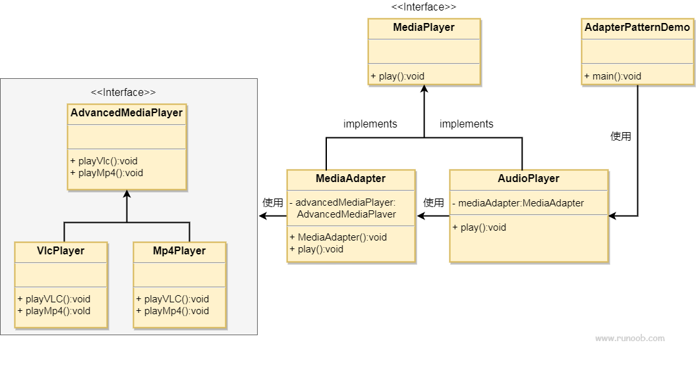

## 实现

桥接（Bridge）是用于把抽象化与实现化解耦，使得二者可以独立变化。这种类型的设计模式属于结构型模式，它通过提供抽象化和实现化之间的桥接结构，来实现二者的解耦。

这种模式涉及到一个作为桥接的接口，使得实体类的功能独立于接口实现类。这两种类型的类可被结构化改变而互不影响。

我们通过下面的实例来演示桥接模式（Bridge Pattern）的用法。其中，可以使用相同的抽象类方法但是不同的桥接实现类，来画出不同颜色的圆。

## 优点

## 缺点

## 实例

